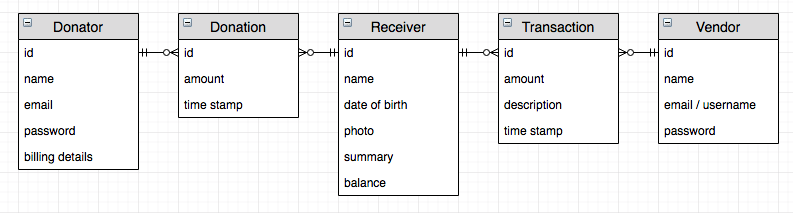

# iHelp

Imperial College Hackathon 2019

## Overview

Often when we want to donate to a homeless person we either have no cash on person, or are too sceptical about how they may spend the money. Our system allows donations to be made with digital credit, which can be redeemed at homeless shelters. This way the donator has no need for cash, and can be sure that the money is being spent on food and shelter.

Another problem with donation in general is that it is often not sufficient to fully raise someone from poverty. Those on the streets struggle to re-enter society, as without proper dress, hygiene, a home address or phone number they simply cannot attain a job. Mental health problems and addictions are also not properly attended to.

Increasing the volume of donations and directing *all* of it to homeless shelters would provide them with huge amounts of funding. Shelters can expand; providing more beds and food, offering rehabilitation courses, job application advice etc.

Our system provides an interactive prototype for this form of donation. 

Homeless "receivers" can register at any homeless shelter and obtain their QR code. They can then show this QR code to anyone who wants to donate. The donator opens up our app on their device (Android or iOS) and scans the QR code to donate their desired amount. The donator can then view a list of their complete donation history.

The website side to our system is for use within the homeless shelters. They are able to (1) register new "receivers", (2) make transactions, deducting credit in exchange for the shelter's services, and finally (3) search through and edit "receiver" profiles.

## Tech

We built three separate systems; both front ends utilise the React framework, and the server is built on Java Spring.

